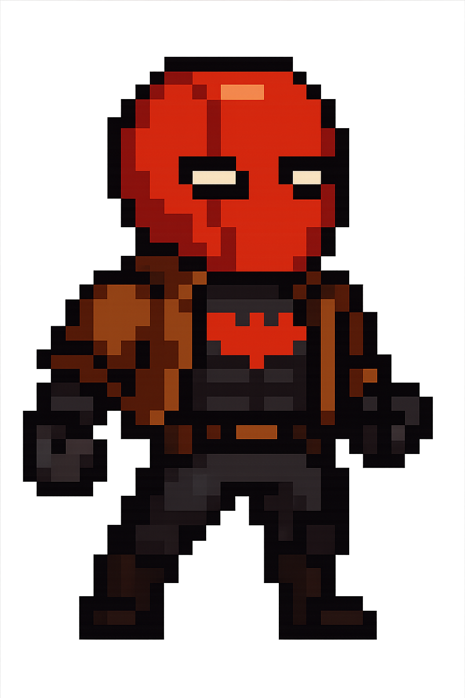
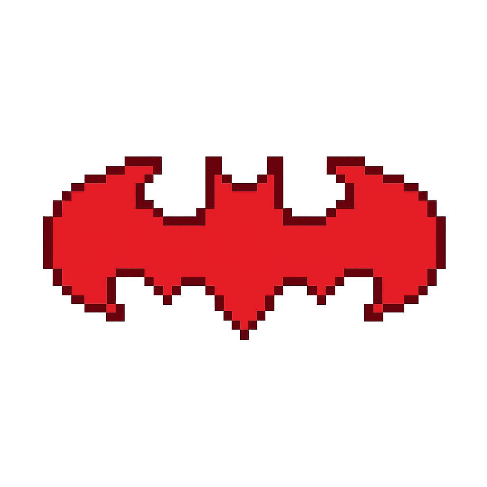

<!DOCTYPE html>
<html lang="en">
<head>
    <meta charset="UTF-8">
    <meta name="viewport" content="width=device-width, initial-scale=1.0">
    <title>My GitHub Profile</title>
    
</head>
<body>
    

        <!-- Header Section -->
        

            
            
            <h1>👋 Welcome to my GitHub Profile!</h1>
            <h3>🦇 Developer | 🔴 Tech Enthusiast | 🎮 Retro Gaming Fan</h3>
        

        <!-- About Me Section -->
        

            <h2>🚀 About Me</h2>
            <code>
const developer = {
    name: "Your Name",
    role: "Full Stack Developer", 
    location: "Nagpur, Maharashtra, India",
    interests: ["Web Development", "Gaming", "Comic Books", "Open Source"],
    currentlyLearning: ["React", "Node.js", "Python"],
    funFact: "I create pixel art in my free time! 🎨"
};
            </code>
        

        <!-- Tech Stack Section -->
        

            <h2>🛠️ Tech Stack & Tools</h2>
            

                JavaScript
                Python
                React
                Node.js
                HTML5
                CSS3
                Git
                VS Code
            

        

        <!-- Stats Section -->
        

            <h2>📊 GitHub Stats</h2>
            

                

                    <h3>🔥 Repositories</h3>
                    
25+

                

                

                    <h3>⭐ Stars Earned</h3>
                    
100+

                

                

                    <h3>🤝 Followers</h3>
                    
50+

                

            

        

        <!-- Current Focus Section -->
        

            <h2>🎯 Current Focus</h2>
            <ul>
                <li>🔭 Working on: <strong>Web Development Projects</strong></li>
                <li>🌱 Learning: <strong>Advanced React & Backend Technologies</strong></li>
                <li>👯 Looking to collaborate on: <strong>Open Source Projects</strong></li>
                <li>💬 Ask me about: <strong>JavaScript, Python, Pixel Art</strong></li>
                <li>⚡ Fun fact: <strong>I recreate comic book characters in 8-bit style!</strong></li>
            </ul>
        

        <!-- Featured Projects Section -->
        

            <h2>🏆 Featured Projects</h2>
            

                

                    <h3>🎮 Retro Game Hub</h3>
                    
Collection of classic games recreated in modern web technologies

                    
<strong>Tech:</strong> HTML5, CSS3, JavaScript

                

                

                    <h3>🦸‍♂️ Hero Database</h3>
                    
Comprehensive comic character information application

                    
<strong>Tech:</strong> React, Node.js, MongoDB

                

                

                    <h3>🎨 Pixel Art Creator</h3>
                    
Online tool for creating retro-style pixel art

                    
<strong>Tech:</strong> Canvas API, JavaScript

                

            

        

        <!-- Gaming & Interests Section -->
        

            <h2>🎮 Gaming & Interests</h2>
            

                🕹️ Retro Gaming
                🦇 DC Comics Fan
                🎨 Pixel Art Creator
                📚 Continuous Learning
                🌟 Open Source
            

        

        <!-- Social Links -->
        

            <h2>🤝 Connect With Me</h2>
            

                <a href="https://linkedin.com/in/YOUR_LINKEDIN">LinkedIn</a>
                <a href="https://twitter.com/YOUR_TWITTER">Twitter</a>
                <a href="mailto:your.email@gmail.com">Email</a>
                <a href="https://instagram.com/YOUR_INSTAGRAM">Instagram</a>
            

        

        <!-- Footer -->
        

            
<strong>Thanks for visiting! ⭐ Star some repositories if you find them interesting!</strong>

            
            
Profile Views: 1,234

        

    

</body>
</html>
